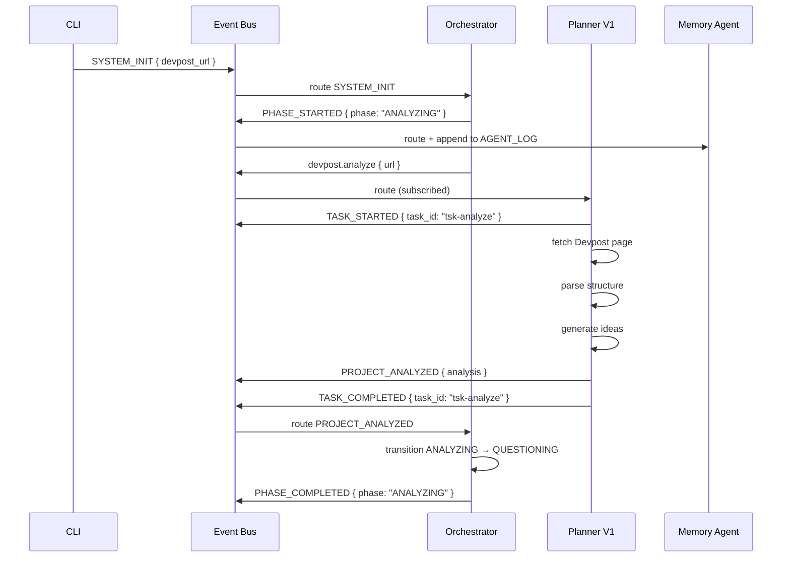
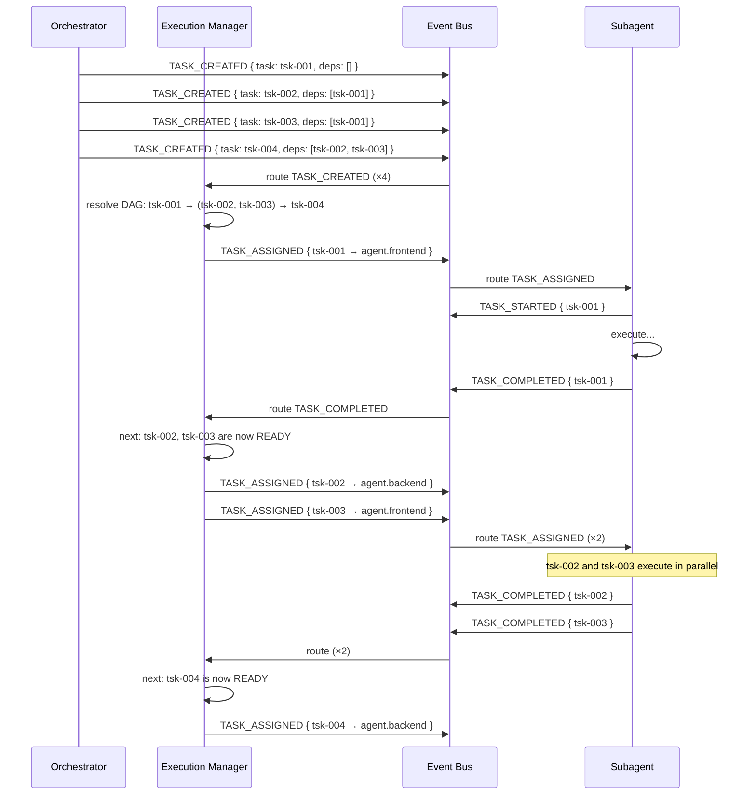
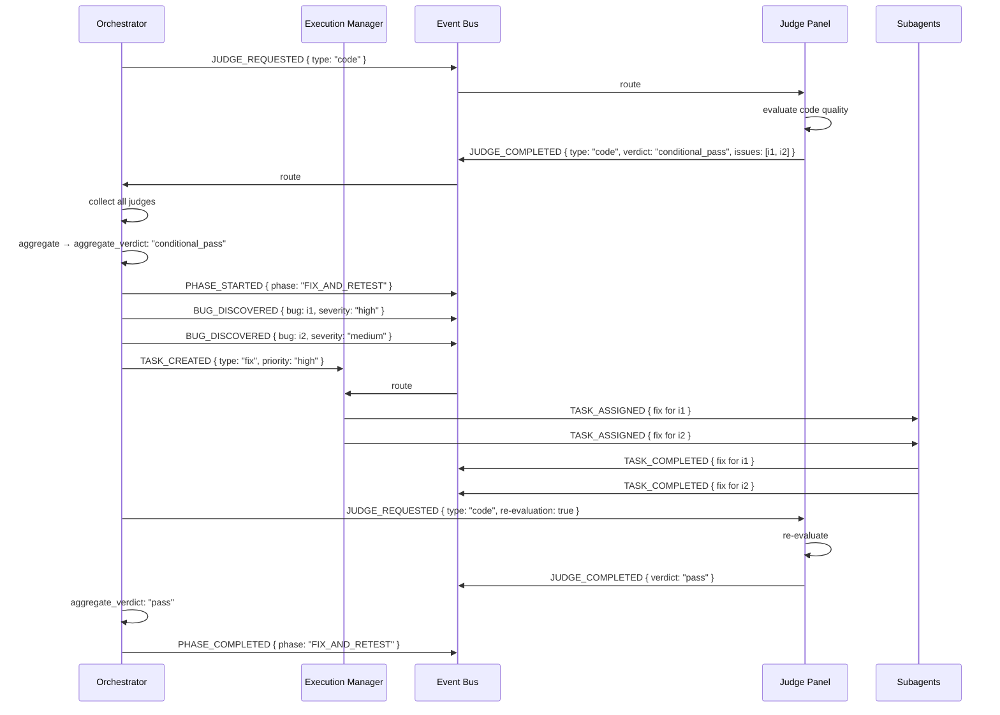
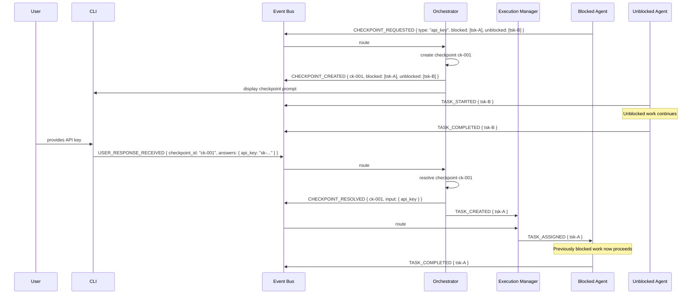

# Hack-A-Gent: Internal Protocol Specification

> **Version:** 1.0.0  
> **Status:** Draft for Implementation  
> **Supersedes:** Architecture §6 (Event System), §7 (Communication Protocol)  

---

## Table of Contents

1. [Agent Contract](#1-agent-contract)
2. [Task Contract](#2-task-contract)
3. [Event Contract](#3-event-contract)
4. [Memory Contract](#4-memory-contract)
5. [Tool Contract](#5-tool-contract)
6. [Judge Contract](#6-judge-contract)
7. [Human Checkpoint Contract](#7-human-checkpoint-contract)
8. [Lifecycle Examples](#8-lifecycle-examples)
9. [Sequence Diagrams](#9-sequence-diagrams)

---

## 1. Agent Contract

Every agent in the system must conform to this contract. An agent is considered **valid** if and only if it provides a complete `AgentManifest` and implements the defined lifecycle.

### 1.1 Agent Manifest Schema

**TypeScript Interface:**
```typescript
interface AgentManifest {
  /** Unique identifier for this agent (e.g., "planner.v1", "judge.code") */
  agent_id: string;

  /** Human-readable name */
  agent_name: string;

  /** Classification used for routing */
  agent_type: AgentType;

  /** Semantic version of this agent's contract */
  contract_version: string;

  /** What this agent can do */
  capabilities: AgentCapability[];

  /** Skills this agent needs loaded into context */
  required_skills: string[];

  /** Event types this agent subscribes to */
  event_subscriptions: string[];

  /** Task types this agent can execute */
  accepted_tasks: TaskType[];

  /** Artifacts this agent produces */
  produced_outputs: OutputSpecification[];

  /** Tools this agent is permitted to use */
  accessible_tools: ToolPermission[];

  /** Memory files this agent can read/write */
  accessible_memories: MemoryPermission[];

  /** Rules for when to escalate to orchestrator */
  escalation_rules: EscalationRule[];

  /** Maximum execution time before forced timeout (ms) */
  timeout_ms: number;

  /** Maximum consecutive failures before escalation */
  max_retries: number;
}
```

**JSON Schema:**
```json
{
  "$schema": "http://json-schema.org/draft-07/schema#",
  "$id": "https://hackagent.dev/schemas/agent-manifest.json",
  "title": "AgentManifest",
  "type": "object",
  "required": [
    "agent_id", "agent_name", "agent_type", "contract_version",
    "capabilities", "event_subscriptions", "accepted_tasks",
    "produced_outputs", "accessible_tools", "accessible_memories",
    "escalation_rules", "timeout_ms", "max_retries"
  ],
  "properties": {
    "agent_id": {
      "type": "string",
      "pattern": "^[a-z0-9]+(\\.[a-z0-9]+)*$",
      "description": "Dot-notation identifier, e.g., 'judge.code' or 'execution.scheduler'"
    },
    "agent_name": { "type": "string" },
    "agent_type": {
      "type": "string",
      "enum": [
        "orchestrator",
        "planner",
        "question",
        "architect",
        "execution",
        "subagent",
        "judge",
        "infrastructure",
        "utility"
      ]
    },
    "contract_version": {
      "type": "string",
      "pattern": "^\\d+\\.\\d+\\.\\d+$"
    },
    "capabilities": {
      "type": "array",
      "items": { "$ref": "#/definitions/AgentCapability" }
    },
    "required_skills": {
      "type": "array",
      "items": { "type": "string" }
    },
    "event_subscriptions": {
      "type": "array",
      "items": {
        "type": "string",
        "pattern": "^[a-z]+(\\.[a-z]+)*$"
      }
    },
    "accepted_tasks": {
      "type": "array",
      "items": {
        "type": "string",
        "enum": [
          "analysis",
          "planning",
          "architecture",
          "implementation",
          "testing",
          "judging",
          "documentation",
          "devops",
          "fix"
        ]
      }
    },
    "produced_outputs": {
      "type": "array",
      "items": { "$ref": "#/definitions/OutputSpecification" }
    },
    "accessible_tools": {
      "type": "array",
      "items": { "$ref": "#/definitions/ToolPermission" }
    },
    "accessible_memories": {
      "type": "array",
      "items": { "$ref": "#/definitions/MemoryPermission" }
    },
    "escalation_rules": {
      "type": "array",
      "items": { "$ref": "#/definitions/EscalationRule" },
      "minItems": 1
    },
    "timeout_ms": {
      "type": "integer",
      "minimum": 1000,
      "maximum": 600000
    },
    "max_retries": {
      "type": "integer",
      "minimum": 0,
      "maximum": 10
    }
  },
  "definitions": {
    "AgentCapability": {
      "type": "object",
      "required": ["capability_id", "description", "input_schema", "output_schema"],
      "properties": {
        "capability_id": { "type": "string" },
        "description": { "type": "string" },
        "input_schema": { "type": "object" },
        "output_schema": { "type": "object" }
      }
    },
    "OutputSpecification": {
      "type": "object",
      "required": ["output_id", "description", "mime_type", "path_template"],
      "properties": {
        "output_id": { "type": "string" },
        "description": { "type": "string" },
        "mime_type": { "type": "string" },
        "path_template": { "type": "string" }
      }
    },
    "ToolPermission": {
      "type": "object",
      "required": ["tool_name", "access_level"],
      "properties": {
        "tool_name": { "type": "string" },
        "access_level": {
          "type": "string",
          "enum": ["read", "write", "execute", "admin"]
        },
        "constraints": { "type": "object" }
      }
    },
    "MemoryPermission": {
      "type": "object",
      "required": ["file", "access"],
      "properties": {
        "file": {
          "type": "string",
          "enum": ["AGENT_LOG.md", "BUGS.md", "DECISIONS.md", "TODO.md"]
        },
        "access": {
          "type": "string",
          "enum": ["append", "read", "update", "admin"]
        }
      }
    },
    "EscalationRule": {
      "type": "object",
      "required": ["condition", "action"],
      "properties": {
        "condition": {
          "type": "string",
          "enum": [
            "max_retries_exceeded",
            "timeout_reached",
            "invalid_input",
            "tool_failure",
            "missing_information",
            "ambiguous_state"
          ]
        },
        "action": {
          "type": "string",
          "enum": [
            "emit_error_event",
            "request_human_checkpoint",
            "request_task_reassignment",
            "rollback_to_recovery_point",
            "abort_phase"
          ]
        },
        "message": { "type": "string" }
      }
    }
  }
}
```

### 1.2 Agent State Machine

Every agent follows a deterministic internal state machine:

```
                 ┌──────────────────────────────────────┐
                 │                                      │
                 ▼                                      │
  ┌─────────┐ ┌──────┐  event   ┌──────────┐  emit   ┌───────┐
  │ SLEEPING │→│WAKE  │─────────►│PROCESSING│────────►│DONE   │──► SLEEPING
  └─────────┘ └──────┘          └────┬─────┘          └───────┘
                                     │
                               error │
                                     ▼
                               ┌─────────┐  retry < max  ┌─────────┐
                               │ FAILED  │──────────────►│ RETRY   │──► WAKE
                               └────┬────┘               └─────────┘
                                    │
                              max retries │
                                    ▼
                               ┌──────────┐
                               │ ESCALATED│──► emit error.escalated
                               └──────────┘
```

**Transition Rules:**
| From | To | Trigger |
|------|----|---------|
| SLEEPING | WAKE | Event received from bus matching subscriptions |
| WAKE | PROCESSING | Context prepared, manifest validated |
| PROCESSING | DONE | Work completed, result emitted |
| DONE | SLEEPING | Acknowledgment received from bus |
| PROCESSING | FAILED | Unhandled error or timeout |
| FAILED | RETRY | `retry_count < max_retries` |
| RETRY | WAKE | Backoff elapsed |
| FAILED | ESCALATED | `retry_count >= max_retries` |
| ESCALATED | SLEEPING | Escalation event emitted |

### 1.3 Agent Lifecycle Hooks

```typescript
interface AgentLifecycle {
  /** Called once at system startup */
  onRegister(manifest: AgentManifest): void;

  /** Called when a relevant event arrives */
  onEvent(event: Event): Promise<void>;

  /** Called before task execution begins */
  onTaskStart(task: Task): Promise<void>;

  /** Called after task execution completes */
  onTaskComplete(task: Task, result: TaskResult): Promise<void>;

  /** Called when an error is caught */
  onError(error: AgentError): Promise<RecoveryAction>;

  /** Called before the agent enters SLEEPING */
  onSleep(): Promise<void>;
}
```

### 1.4 Agent Exit Codes

| Code | Name | Meaning |
|------|------|---------|
| `AGENT_OK` | Success | Work completed, expected outputs produced |
| `AGENT_FAIL` | Recoverable Failure | Transient error, safe to retry |
| `AGENT_FATAL` | Unrecoverable Failure | Permanent error, escalate |
| `AGENT_SKIP` | Skipped | Task not applicable, no action taken |
| `AGENT_STALE` | Stale Input | Input already superseded, ignore |

---

## 2. Task Contract

Every unit of work in the system is encapsulated as a Task. Tasks flow through the system via events and are executed by agents.

### 2.1 Task Schema

**TypeScript Interface:**
```typescript
interface Task {
  /** Unique identifier (UUID v4) */
  task_id: string;

  /** Project this task belongs to */
  project_id: string;

  /** Parent task (for sub-tasks); null for root tasks */
  parent_task_id: string | null;

  /** Agent that created this task */
  creator_agent: string;

  /** Agent assigned to execute this task; null until assigned */
  assigned_agent: string | null;

  /** Current lifecycle status */
  status: TaskStatus;

  /** Classification for routing */
  type: TaskType;

  /** Human-readable summary */
  description: string;

  /** IDs of tasks that must complete before this starts */
  dependencies: string[];

  /** Criteria that must be met for completion */
  acceptance_criteria: AcceptanceCriterion[];

  /** Retry tracking */
  retries: RetryPolicy;

  /** Relative importance */
  priority: TaskPriority;

  /** Whether this task requires a human checkpoint */
  checkpoint_required: boolean;

  /** Skills required to execute this task */
  required_skills: string[];

  /** Execution context / parameters */
  input: Record<string, unknown>;

  /** Expected output paths */
  expected_outputs: string[];

  /** Error information if failed */
  error: TaskError | null;

  /** Timestamps */
  timestamps: TaskTimestamps;
}
```

**JSON Schema:**
```json
{
  "$schema": "http://json-schema.org/draft-07/schema#",
  "$id": "https://hackagent.dev/schemas/task.json",
  "title": "Task",
  "type": "object",
  "required": [
    "task_id", "project_id", "creator_agent", "status",
    "type", "description", "dependencies", "acceptance_criteria",
    "retries", "priority", "timestamps"
  ],
  "properties": {
    "task_id": {
      "type": "string",
      "pattern": "^[0-9a-f]{8}-[0-9a-f]{4}-[0-9a-f]{4}-[0-9a-f]{4}-[0-9a-f]{12}$"
    },
    "project_id": { "type": "string" },
    "parent_task_id": {
      "type": ["string", "null"],
      "default": null
    },
    "creator_agent": { "type": "string" },
    "assigned_agent": {
      "type": ["string", "null"],
      "default": null
    },
    "status": {
      "type": "string",
      "enum": ["PENDING", "READY", "RUNNING", "WAITING", "BLOCKED", "FAILED", "COMPLETED", "SKIPPED"]
    },
    "type": {
      "type": "string",
      "enum": [
        "analysis",
        "planning",
        "architecture",
        "implementation",
        "testing",
        "judging",
        "documentation",
        "devops",
        "fix",
        "refactor",
        "review"
      ]
    },
    "description": { "type": "string" },
    "dependencies": {
      "type": "array",
      "items": { "type": "string" }
    },
    "acceptance_criteria": {
      "type": "array",
      "items": { "$ref": "#/definitions/AcceptanceCriterion" },
      "minItems": 1
    },
    "retries": { "$ref": "#/definitions/RetryPolicy" },
    "priority": {
      "type": "string",
      "enum": ["critical", "high", "medium", "low"]
    },
    "checkpoint_required": { "type": "boolean" },
    "required_skills": {
      "type": "array",
      "items": { "type": "string" }
    },
    "input": { "type": "object" },
    "expected_outputs": {
      "type": "array",
      "items": { "type": "string" }
    },
    "error": {
      "type": ["object", "null"],
      "$ref": "#/definitions/TaskError"
    },
    "timestamps": { "$ref": "#/definitions/TaskTimestamps" }
  },
  "definitions": {
    "AcceptanceCriterion": {
      "type": "object",
      "required": ["criterion_id", "description", "verification_method"],
      "properties": {
        "criterion_id": { "type": "string" },
        "description": { "type": "string" },
        "verification_method": {
          "type": "string",
          "enum": ["manual_review", "automated_test", "judge_evaluation", "lint_check", "build_check"]
        },
        "verified": { "type": "boolean", "default": false }
      }
    },
    "RetryPolicy": {
      "type": "object",
      "required": ["max_retries", "backoff_ms", "current_attempt"],
      "properties": {
        "max_retries": { "type": "integer", "minimum": 0 },
        "backoff_ms": { "type": "integer", "minimum": 0 },
        "current_attempt": { "type": "integer", "minimum": 0 }
      }
    },
    "TaskError": {
      "type": "object",
      "required": ["code", "message", "timestamp"],
      "properties": {
        "code": {
          "type": "string",
          "enum": [
            "TIMEOUT",
            "DEPENDENCY_FAILURE",
            "TOOL_FAILURE",
            "VALIDATION_FAILURE",
            "INTERNAL_ERROR",
            "CHECKPOINT_BLOCKED"
          ]
        },
        "message": { "type": "string" },
        "details": { "type": "object" },
        "timestamp": { "type": "string", "format": "date-time" }
      }
    },
    "TaskTimestamps": {
      "type": "object",
      "required": ["created_at"],
      "properties": {
        "created_at": { "type": "string", "format": "date-time" },
        "assigned_at": { "type": ["string", "null"], "format": "date-time" },
        "started_at": { "type": ["string", "null"], "format": "date-time" },
        "completed_at": { "type": ["string", "null"], "format": "date-time" },
        "deadline": { "type": ["string", "null"], "format": "date-time" }
      }
    }
  }
}
```

### 2.2 Task Status Lifecycle

```
                         ┌──────────┐
                         │ PENDING  │── dependencies not met
                         └────┬─────┘
                              │ all deps resolved
                              ▼
                         ┌──────────┐
                         │  READY   │── awaiting assignment
                         └────┬─────┘
                              │ agent assigned
                              ▼
                    ┌─────────────────┐
            ┌──────│    RUNNING      │──────┐
            │      └────────┬────────┘      │
            │               │                │
            │          ┌────▼────┐          │
            │  ┌───────│COMPLETED│          │
   blocking │  │       └─────────┘          │ error
   input    │  │                            │
            ▼  │                            ▼
    ┌─────────┐│                   ┌───────────┐
    │ WAITING ││                   │  FAILED   │
    └─────────┘│                   └─────┬─────┘
            │  │                         │
            │  │                    ┌────▼────┐
            │  │                    │ retry?  │
            │  │                    ├───┬──┬──┤
            │  │               yes  │   │  │ no
            │  │              ┌─────┘   │  └──────┐
            │  │              │         │         │
            │  │         ┌────▼──┐  ┌───▼───┐ ┌───▼─────┐
            │  │         │ READY │  │PENDING│ │ESCALATED│
            │  │         └───────┘  └───────┘ └─────────┘
            │  │
            │  └── user input received → READY
            │
            └── dependency failed → BLOCKED → re-evaluated periodically

    ┌──────────┐
    │ SKIPPED  │── optional task, execution manager chose to skip
    └──────────┘
```

### 2.3 Task Status Definitions

| Status | Meaning | Next Statuses | Transition Trigger |
|--------|---------|--------------|-------------------|
| `PENDING` | Created but dependencies not met | `READY` | All dependencies are `COMPLETED` |
| `READY` | All deps met, awaiting assignment | `RUNNING`, `SKIPPED` | Agent assigned to task |
| `RUNNING` | Currently being executed by agent | `COMPLETED`, `FAILED`, `WAITING` | Agent completes / errors / hits checkpoint |
| `WAITING` | Blocked on human input | `READY`, `BLOCKED` | User input received / timeout |
| `BLOCKED` | Blocked by dependency failure | `PENDING`, `FAILED` | Dep resolved / unrecoverable |
| `FAILED` | Execution failed | `PENDING`, `READY`, `ESCALATED` | Retry decision |
| `COMPLETED` | Successfully finished | Terminal | N/A |
| `SKIPPED` | Deliberately not executed | Terminal | N/A |

### 2.4 Task Priority Rules

| Priority | Sla | Preemption | Retry Limit |
|----------|-----|------------|-------------|
| `critical` | 2 min | Preempts all lower | 5 |
| `high` | 10 min | Preempts medium/low | 3 |
| `medium` | 30 min | Cannot preempt | 3 |
| `low` | 60 min | Cannot preempt | 1 |

### 2.5 Task Result Schema

```typescript
interface TaskResult {
  task_id: string;
  status: "COMPLETED" | "FAILED" | "SKIPPED";
  exit_code: "AGENT_OK" | "AGENT_FAIL" | "AGENT_FATAL" | "AGENT_SKIP";

  /** Output artifacts (file paths relative to project root) */
  artifacts: string[];

  /** Verification of each acceptance criterion */
  criteria_results: Array<{
    criterion_id: string;
    passed: boolean;
    evidence: string;
  }>;

  /** Summary for logs */
  summary: string;

  /** Error if failed */
  error: TaskError | null;
}
```

---

## 3. Event Contract

All inter-agent communication occurs through typed events on the event bus.

### 3.1 Event Envelope Schema

**TypeScript Interface:**
```typescript
interface EventEnvelope {
  /** Unique event identifier (UUID v4) */
  event_id: string;

  /** Dot-notation event type (see catalog below) */
  type: string;

  /** Agent that emitted this event */
  source: string;

  /** Target agent(s): specific ID, role, or "*" (broadcast) */
  target: string | string[];

  /** ISO 8601 UTC timestamp */
  timestamp: string;

  /** Schema version for forward compatibility */
  schema_version: string;

  /** Correlates events across the same workflow */
  correlation_id: string;

  /** Links to originating event chain */
  causation_id: string | null;

  /** Business payload */
  payload: Record<string, unknown>;

  /** Delivery metadata */
  metadata: EventMetadata;
}
```

**JSON Schema:**
```json
{
  "$schema": "http://json-schema.org/draft-07/schema#",
  "$id": "https://hackagent.dev/schemas/event-envelope.json",
  "title": "EventEnvelope",
  "type": "object",
  "required": [
    "event_id", "type", "source", "target",
    "timestamp", "schema_version", "correlation_id", "payload", "metadata"
  ],
  "properties": {
    "event_id": {
      "type": "string",
      "pattern": "^[0-9a-f]{8}-[0-9a-f]{4}-[0-9a-f]{4}-[0-9a-f]{4}-[0-9a-f]{12}$"
    },
    "type": { "type": "string", "pattern": "^[A-Z][A-Z0-9_]+$" },
    "source": { "type": "string" },
    "target": {
      "oneOf": [
        { "type": "string" },
        { "type": "array", "items": { "type": "string" } }
      ]
    },
    "timestamp": { "type": "string", "format": "date-time" },
    "schema_version": { "type": "string", "pattern": "^\\d+\\.\\d+$" },
    "correlation_id": { "type": "string" },
    "causation_id": {
      "type": ["string", "null"],
      "default": null
    },
    "payload": { "type": "object" },
    "metadata": { "$ref": "#/definitions/EventMetadata" }
  },
  "definitions": {
    "EventMetadata": {
      "type": "object",
      "required": ["priority", "delivery_guarantee", "ttl_ms", "retry_count"],
      "properties": {
        "priority": {
          "type": "string",
          "enum": ["critical", "high", "normal", "low"]
        },
        "delivery_guarantee": {
          "type": "string",
          "enum": ["at_most_once", "at_least_once", "exactly_once"]
        },
        "ttl_ms": {
          "type": "integer",
          "description": "Time-to-live in milliseconds; event discarded after this"
        },
        "retry_count": {
          "type": "integer",
          "minimum": 0,
          "default": 0
        },
        "max_retries": {
          "type": "integer",
          "minimum": 0,
          "default": 3
        },
        "blocking": {
          "type": "boolean",
          "default": false,
          "description": "If true, orchestrator waits for acknowledgment before continuing"
        },
        "persist": {
          "type": "boolean",
          "default": true,
          "description": "If true, event is persisted to event log"
        }
      }
    }
  }
}
```

### 3.2 Event Type Catalog

Every event type follows the naming convention `DOMAIN_ACTION` in UPPER_SNAKE_CASE.

#### 3.2.1 System Events

| Event Type | Source | Target | Payload | Description |
|-----------|--------|--------|---------|-------------|
| `SYSTEM_INIT` | CLI/User | `orchestrator` | `{ devpost_url, preferences }` | Start new hackathon session |
| `SYSTEM_SHUTDOWN` | User/Orch. | `*` | `{ reason }` | Graceful shutdown |
| `SYSTEM_ERROR` | Any | `orchestrator` | `{ source, code, message }` | Unrecoverable error |
| `SYSTEM_HEARTBEAT` | Any | `orchestrator` | `{ agent_id, status, running_task }` | Liveness check |
| `SYSTEM_STATE_SNAPSHOT` | Orch. | `memory` | `{ phase, tasks, checkpoint }` | State persistence |

#### 3.2.2 Phase Events

| Event Type | Source | Target | Payload | Description |
|-----------|--------|--------|---------|-------------|
| `PHASE_STARTED` | Orch. | `*` | `{ phase }` | Phase began |
| `PHASE_COMPLETED` | Orch. | `*` | `{ phase, summary }` | Phase completed |
| `PHASE_FAILED` | Orch. | `*` | `{ phase, error }` | Phase failed |
| `PHASE_TIMEOUT` | Orch. | `*` | `{ phase, elapsed_ms }` | Phase exceeded time limit |

#### 3.2.3 Project Events

| Event Type | Source | Target | Payload | Description |
|-----------|--------|--------|---------|-------------|
| `PROJECT_CREATED` | Orch. | `*` | `{ project_id, devpost_url }` | Project initialized |
| `PROJECT_UPDATED` | Any | `orchestrator` | `{ project_id, field, value }` | Project attribute changed |
| `PROJECT_ANALYZED` | `planner.v1` | `orch.` | `{ project_id, analysis }` | Devpost analysis complete |
| `PROJECT_COMPLETED` | Orch. | `*` | `{ project_id, submission }` | Project finished |
| `PROJECT_ABORTED` | Orch./User | `*` | `{ project_id, reason }` | Project terminated |

#### 3.2.4 Task Events

| Event Type | Source | Target | Payload | Description |
|-----------|--------|--------|---------|-------------|
| `TASK_CREATED` | Orch./Exec. | `*` | `{ task }` | Task created |
| `TASK_ASSIGNED` | Exec. | Agent + Orch. | `{ task_id, agent_id }` | Task given to agent |
| `TASK_STARTED` | Agent | `orchestrator` | `{ task_id, agent_id }` | Agent began execution |
| `TASK_COMPLETED` | Agent | `orchestrator` | `{ task_id, result }` | Task succeeded |
| `TASK_FAILED` | Agent | `orchestrator` | `{ task_id, error }` | Task failed |
| `TASK_PROGRESS` | Agent | `orchestrator` | `{ task_id, progress_pct, message }` | Progress update |
| `TASK_BLOCKED` | Exec. | `orchestrator` | `{ task_id, reason, blocked_by }` | Task dependencies blocked |
| `TASK_WAITING` | Exec. | `orchestrator` | `{ task_id, checkpoint_id }` | Human checkpoint reached |
| `TASK_RETRYING` | Exec. | `orchestrator` | `{ task_id, attempt, backoff }` | Retry in progress |

#### 3.2.5 User Interaction Events

| Event Type | Source | Target | Payload | Description |
|-----------|--------|--------|---------|-------------|
| `USER_QUESTIONS_GENERATED` | `question` | Orch.+CLI | `{ checkpoint_id, questions }` | Questions ready for user |
| `USER_RESPONSE_RECEIVED` | CLI/User | `orchestrator` | `{ checkpoint_id, answers }` | User answered |
| `USER_RESPONSE_TIMEOUT` | Orch. | `*` | `{ checkpoint_id, elapsed_ms }` | User did not respond |
| `USER_PREFERENCES_UPDATED` | CLI/User | `orchestrator` | `{ preferences }` | User changed preferences |

#### 3.2.6 Checkpoint Events

| Event Type | Source | Target | Payload | Description |
|-----------|--------|--------|---------|-------------|
| `CHECKPOINT_REQUESTED` | Any | `orch.` | `{ checkpoint_id, reason, type, required_input }` | Agent needs human action |
| `CHECKPOINT_CREATED` | Orch. | `*` | `{ checkpoint_id, blocked_tasks, unblocked_tasks }` | Checkpoint registered |
| `CHECKPOINT_RESOLVED` | User/CLI | `*` | `{ checkpoint_id, input }` | Checkpoint resolved |
| `CHECKPOINT_EXPIRED` | Orch. | `*` | `{ checkpoint_id, fallback_action }` | Deadline passed |

#### 3.2.7 Judge Events

| Event Type | Source | Target | Payload | Description |
|-----------|--------|--------|---------|-------------|
| `JUDGE_REQUESTED` | Orch. | Judge agent | `{ judge_type, artifacts, criteria }` | Request evaluation |
| `JUDGE_STARTED` | Judge | `orchestrator` | `{ judge_type }` | Judge began analysis |
| `JUDGE_COMPLETED` | Judge | `orchestrator` | `{ judge_type, report }` | Judge finished (pass) |
| `JUDGE_FAILED` | Judge | `orchestrator` | `{ judge_type, error }` | Judge could not evaluate |
| `JUDGE_PASSED` | Orch. | `*` | `{ judge_type, score }` | Judge threshold met |
| `JUDGE_OVERRULED` | Orch. | `*` | `{ judge_type, reason }` | Judge verdict overridden |

#### 3.2.8 Bug Events

| Event Type | Source | Target | Payload | Description |
|-----------|--------|--------|---------|-------------|
| `BUG_DISCOVERED` | Test/Judge | `orchestrator` | `{ bug }` | Bug found |
| `BUG_FIX_STARTED` | Exec. | `orchestrator` | `{ bug_id, task_id }` | Fix begun |
| `BUG_FIXED` | Subagent | `orchestrator` | `{ bug_id, fix_summary }` | Fix applied |
| `BUG_VERIFIED` | Test Agent | `orchestrator` | `{ bug_id, passed }` | Fix verified |

#### 3.2.9 Git Events

| Event Type | Source | Target | Payload | Description |
|-----------|--------|--------|---------|-------------|
| `GIT_COMMIT_REQUESTED` | Any | `git` | `{ message, type, files }` | Request commit |
| `GIT_COMMITTED` | `git` | `*` | `{ hash, branch, summary }` | Commit created |
| `GIT_BRANCH_CREATED` | `git` | `*` | `{ branch, base }` | Safety branch created |
| `GIT_ROLLBACK_REQUESTED` | Orch. | `git` | `{ target }` | Rollback requested |
| `GIT_ROLLED_BACK` | `git` | `*` | `{ from, to, hash }` | Rollback complete |
| `GIT_RECOVERY_POINT` | `git` | `*` | `{ tag, hash, phase }` | Recovery tag created |

#### 3.2.10 Memory Events

| Event Type | Source | Target | Payload | Description |
|-----------|--------|--------|---------|-------------|
| `MEMORY_APPEND` | Any | `memory` | `{ file, content }` | Append to memory file |
| `MEMORY_UPDATED` | `memory` | `*` | `{ file, entry_id }` | Memory write confirmed |
| `MEMORY_QUERY` | Any | `memory` | `{ file, filters }` | Request memory read |
| `MEMORY_QUERY_RESULT` | `memory` | requester | `{ entries }` | Memory read result |

### 3.3 Event Acknowledgment

Agents must acknowledge critical events within the TTL. The bus provides two acknowledgment mechanisms:

#### 3.3.1 Explicit ACK

```typescript
interface EventAck {
  event_id: string;
  receiver: string;
  status: "accepted" | "rejected" | "deferred";
  reason?: string;
}
```

#### 3.3.2 Implicit ACK via Response Event

When an agent emits a response event with matching `causation_id`, it is considered an implicit acknowledgment of the causating event.

### 3.4 Event Filtering and Routing

The event bus routes based on:

1. **Explicit target**: `target: "judge.code"` → only `judge.code`
2. **Agent type**: `target: "judge"` → all agents with `agent_type: "judge"`
3. **Broadcast**: `target: "*"` → all agents
4. **Subscription match**: Any agent whose `event_subscriptions` matches the `type` field via glob pattern

---

## 4. Memory Contract

Memory files are the system's persistent, human-readable knowledge store. Every read and write operation must conform to these contracts.

### 4.1 General Rules

1. **Append-only**: Logs, decisions, and bug entries are never deleted or modified in place.
2. **Timestamped**: Every entry must begin with an ISO 8601 UTC timestamp.
3. **Traceable**: Every entry must include the agent_id that created it.
4. **Linked**: Every entry must reference the relevant task_id(s) when applicable.
5. **Structured**: Every entry follows a defined template with machine-parseable sections.
6. **Atomic**: Each memory operation is logged in the event bus before the file write.

### 4.2 AGENT_LOG.md Contract

**Purpose:** Chronological record of all actions, decisions, and state changes.

**Access:** Append-only by all agents. Read-only for context.

**Template:**
```markdown
## [{timestamp}] Phase: {phase} — Agent: {agent_id}
**Action:** {action_verb}  
**Task:** {task_id}  
**Correlation:** {event_correlation_id}

{body}

**Result:** {success | failure | partial}  
**Artifacts:** {comma-separated paths}
```

**Append Rules:**
```typescript
interface LogEntry {
  timestamp: string;        // ISO 8601
  phase: string;
  agent_id: string;
  action: string;           // Past-tense verb phrase
  task_id: string | null;
  correlation_id: string;
  body: string;             // Free-form markdown
  result: "success" | "failure" | "partial";
  artifacts: string[];      // Relative file paths
}
```

**Example:**
```markdown
## [2026-06-25T10:00:00Z] Phase: ANALYZING — Agent: planner.v1
**Action:** Fetched and parsed Devpost page  
**Task:** tsk-001  
**Correlation:** corr-abc-123

- URL: https://devpost.com/example-hackathon
- Tracks found: 4
- Prizes found: 12
- Judging criteria: Innovation (25%), Impact (25%), Implementation (25%), Presentation (25%)

**Result:** success  
**Artifacts:** plan/v1-analysis.json, plan/unknowns.json
```

### 4.3 BUGS.md Contract

**Purpose:** Track discovered defects throughout the project lifecycle.

**Access:** Append by Test/Judge agents. Read by all. Update (status changes) by Orchestrator.

**Template:**
```markdown
## Bug-{id} [{timestamp}]
**Severity:** {severity}  
**Found By:** {agent_id}  
**Phase:** {phase}  
**Task:** {task_id}  
**Type:** {functional | security | performance | ux | code_quality}

**Description:**
{detailed description}

**File(s):**
{comma-separated file paths with line numbers}

**Steps to Reproduce:**
{numbered steps or test case reference}

**Status:** {open | in_progress | fixed | verified | wontfix}  
**Assigned To:** {agent_id}  
**Fix Commit:** {git_hash | null}  
**Retest Status:** {pending | passed | failed}
```

**Severity Levels:**
| Severity | Meaning | SLA | Required Action |
|----------|---------|-----|----------------|
| `critical` | Blocks core functionality | Fix immediately | Must fix before submission |
| `high` | Major feature broken | Fix before next phase | Should fix before submission |
| `medium` | Feature works with limitations | Fix within 3 iterations | Fix if time permits |
| `low` | Cosmetic / nice-to-have | No deadline | Fix if all other criteria pass |

**Status Transitions:**
```
open ← discovered
  │
  ├──→ in_progress ← assigned to agent
  │      │
  │      ├──→ fixed ← fix committed
  │      │      │
  │      │      ├──→ verified ← retest passed
  │      │      │
  │      │      └──→ open ← retest failed (re-open)
  │      │
  │      └──→ open ← reassigned
  │
  ├──→ wontfix ← decision made (must have reason)
  │
  └──→ open ← re-opened (regression)
```

```typescript
interface BugEntry {
  id: string;               // "Bug-001", "Bug-002", etc.
  timestamp: string;
  severity: "critical" | "high" | "medium" | "low";
  found_by: string;         // agent_id
  phase: string;
  task_id: string | null;
  type: "functional" | "security" | "performance" | "ux" | "code_quality";
  description: string;
  files: string[];
  steps_to_reproduce: string;
  status: "open" | "in_progress" | "fixed" | "verified" | "wontfix";
  assigned_to: string | null;
  fix_commit: string | null;
  retest_status: "pending" | "passed" | "failed";
}
```

### 4.4 DECISIONS.md Contract

**Purpose:** Record architectural and design decisions with context and rationale.

**Access:** Append by Architect/Planner agents. Read by all. Never modified after creation.

**Template:**
```markdown
## DEC-{id} [{timestamp}]
**Decision:** {one-line summary}  
**Agent:** {agent_id}  
**Task:** {task_id}  
**Phase:** {phase}

**Context:**
{what prompted this decision}

**Alternatives Considered:**
- {alternative 1}: {pros/cons}
- {alternative 2}: {pros/cons}

**Decision Rationale:**
{why this option was chosen}

**Consequences:**
{what this decision affects}

**Status:** {active | superseded | revoked}  
**Superseded By:** {DEC-id | null}
```

```typescript
interface DecisionEntry {
  id: string;               // "DEC-001"
  timestamp: string;
  decision: string;
  agent_id: string;
  task_id: string | null;
  phase: string;
  context: string;
  alternatives: Array<{ name: string; analysis: string }>;
  rationale: string;
  consequences: string;
  status: "active" | "superseded" | "revoked";
  superseded_by: string | null;
}
```

### 4.5 TODO.md Contract

**Purpose:** Real-time task status visible to both system and user.

**Access:** Read/Write by Orchestrator. Read by all agents. Append by Exec Manager.

**Template:**
```markdown
# TODO

## Phase: {current_phase}

### Milestone: {milestone_name}
- [{status_symbol}] `{task_id}` — {description} — {assigned_agent}
  - Dependencies: {dependency_ids | none}
  - Status: {status} {additional_info}

### Blocked Tasks
- [{status_symbol}] `{task_id}` — {description} — {blocked_by}

### Waiting Tasks
- [{status_symbol}] `{task_id}` — {description} — (waiting for: {checkpoint_id})

---

**Legend:** `x` = completed, ` ` = pending, `!` = blocked, `~` = waiting, `-` = skipped
```

**Status Symbols:**
| Symbol | Status |
|--------|--------|
| `x` | COMPLETED |
| ` ` (space) | PENDING / READY |
| `*` | RUNNING |
| `!` | BLOCKED / FAILED |
| `~` | WAITING |
| `-` | SKIPPED |

### 4.6 Memory Query Contract

```typescript
interface MemoryQuery {
  file: "AGENT_LOG.md" | "BUGS.md" | "DECISIONS.md" | "TODO.md";
  filters?: {
    agent_id?: string;
    task_id?: string;
    phase?: string;
    status?: string;
    since?: string;         // ISO 8601
    until?: string;
    severity?: string;      // BUGS only
    limit?: number;
  };
}

interface MemoryQueryResult {
  file: string;
  entries: MemoryEntry[];
  total: number;
  truncated: boolean;
}
```

---

## 5. Tool Contract

Tools are the external capabilities agents can invoke. Every tool must expose a formal contract.

### 5.1 Tool Definition Schema

```typescript
interface ToolDefinition {
  /** Tool identifier */
  tool_id: string;

  /** Human-readable name */
  name: string;

  /** Tool category */
  type: "mcp" | "cli" | "api" | "sdk" | "builtin";

  /** Full input schema (JSON Schema) */
  input_schema: object;

  /** Full output schema (JSON Schema) */
  output_schema: object;

  /** Error output schema */
  error_schema: object;

  /** Retry configuration */
  retry: RetryPolicy;

  /** Timeout per invocation (ms) */
  timeout_ms: number;

  /** Security level required for invocation */
  security_level: "sandboxed" | "restricted" | "elevated" | "admin";

  /** Environment requirements */
  requirements: {
    env_vars?: string[];
    binaries?: string[];
    network_access: boolean;
    filesystem_access: boolean;
  };
}
```

### 5.2 Tool Contract: Playwright MCP

```json
{
  "tool_id": "tool.playwright.mcp",
  "name": "Playwright Browser Automation (MCP)",
  "type": "mcp",
  "input_schema": {
    "type": "object",
    "required": ["action", "url"],
    "properties": {
      "action": {
        "type": "string",
        "enum": [
          "navigate", "click", "type", "screenshot",
          "evaluate", "wait_for_selector", "assert_element",
          "assert_url", "assert_text", "get_html", "get_text"
        ]
      },
      "url": { "type": "string", "format": "uri" },
      "selector": { "type": "string" },
      "value": { "type": "string" },
      "options": {
        "type": "object",
        "properties": {
          "timeout": { "type": "integer", "default": 5000 },
          "viewport": {
            "type": "object",
            "properties": {
              "width": { "type": "integer", "default": 1280 },
              "height": { "type": "integer", "default": 720 }
            }
          },
          "screenshot_path": { "type": "string" }
        }
      }
    }
  },
  "output_schema": {
    "type": "object",
    "properties": {
      "success": { "type": "boolean" },
      "data": { "type": ["string", "object", "null"] },
      "screenshot_path": { "type": ["string", "null"] },
      "duration_ms": { "type": "integer" }
    }
  },
  "error_schema": {
    "type": "object",
    "required": ["code", "message"],
    "properties": {
      "code": {
        "type": "string",
        "enum": [
          "TIMEOUT",
          "ELEMENT_NOT_FOUND",
          "NAVIGATION_FAILED",
          "ASSERTION_FAILED",
          "BROWSER_CRASHED",
          "INVALID_SELECTOR"
        ]
      },
      "message": { "type": "string" },
      "page_state": { "type": "object" }
    }
  },
  "retry": {
    "max_retries": 2,
    "backoff_ms": 1000,
    "retry_on_errors": ["TIMEOUT", "BROWSER_CRASHED"]
  },
  "timeout_ms": 30000,
  "security_level": "sandboxed",
  "requirements": {
    "binaries": ["playwright"],
    "network_access": true,
    "filesystem_access": true
  }
}
```

### 5.3 Tool Contract: Git Operations

```json
{
  "tool_id": "tool.git",
  "name": "Git Version Control",
  "type": "cli",
  "input_schema": {
    "type": "object",
    "required": ["operation"],
    "properties": {
      "operation": {
        "type": "string",
        "enum": [
          "init", "commit", "branch_create", "branch_switch",
          "tag_create", "reset", "stash", "status", "log",
          "diff", "merge", "push"
        ]
      },
      "path": { "type": "string", "description": "Repository path" },
      "message": { "type": "string" },
      "branch_name": { "type": "string" },
      "tag_name": { "type": "string" },
      "target": { "type": "string", "description": "Commit hash or ref" },
      "files": {
        "type": "array",
        "items": { "type": "string" }
      }
    }
  },
  "output_schema": {
    "type": "object",
    "properties": {
      "success": { "type": "boolean" },
      "stdout": { "type": "string" },
      "hash": { "type": "string" },
      "branch": { "type": "string" },
      "summary": { "type": "string" }
    }
  },
  "error_schema": {
    "type": "object",
    "required": ["code", "message"],
    "properties": {
      "code": {
        "type": "string",
        "enum": [
          "CONFLICT", "NOT_A_REPO", "UNCOMMITTED_CHANGES",
          "BRANCH_EXISTS", "INVALID_REF", "PERMISSION_DENIED"
        ]
      },
      "message": { "type": "string" },
      "stderr": { "type": "string" }
    }
  },
  "retry": {
    "max_retries": 1,
    "backoff_ms": 500,
    "retry_on_errors": ["CONFLICT"]
  },
  "timeout_ms": 15000,
  "security_level": "restricted",
  "requirements": {
    "binaries": ["git"],
    "network_access": false,
    "filesystem_access": true
  }
}
```

### 5.4 Tool Contract: LLM Invocation

```json
{
  "tool_id": "tool.llm",
  "name": "LLM Text Generation",
  "type": "api",
  "input_schema": {
    "type": "object",
    "required": ["messages"],
    "properties": {
      "model": { "type": "string", "default": "gpt-4o" },
      "messages": {
        "type": "array",
        "items": {
          "type": "object",
          "required": ["role", "content"],
          "properties": {
            "role": { "type": "string", "enum": ["system", "user", "assistant", "tool"] },
            "content": { "type": "string" }
          }
        }
      },
      "temperature": { "type": "number", "default": 0.3, "minimum": 0, "maximum": 2 },
      "max_tokens": { "type": "integer", "default": 4096 },
      "response_format": {
        "type": "object",
        "properties": {
          "type": { "type": "string", "enum": ["text", "json_object"] }
        }
      }
    }
  },
  "output_schema": {
    "type": "object",
    "required": ["content", "model", "usage"],
    "properties": {
      "content": { "type": "string" },
      "model": { "type": "string" },
      "usage": {
        "type": "object",
        "required": ["prompt_tokens", "completion_tokens", "total_tokens"],
        "properties": {
          "prompt_tokens": { "type": "integer" },
          "completion_tokens": { "type": "integer" },
          "total_tokens": { "type": "integer" }
        }
      },
      "finish_reason": { "type": "string" }
    }
  },
  "error_schema": {
    "type": "object",
    "required": ["code", "message"],
    "properties": {
      "code": {
        "type": "string",
        "enum": [
          "CONTENT_FILTERED", "TOKEN_LIMIT", "RATE_LIMITED",
          "TIMEOUT", "INVALID_REQUEST", "API_ERROR"
        ]
      },
      "message": { "type": "string" }
    }
  },
  "retry": {
    "max_retries": 3,
    "backoff_ms": 2000,
    "retry_on_errors": ["RATE_LIMITED", "TIMEOUT", "API_ERROR"]
  },
  "timeout_ms": 120000,
  "security_level": "restricted",
  "requirements": {
    "env_vars": ["OPENAI_API_KEY"],
    "network_access": true,
    "filesystem_access": false
  }
}
```

### 5.5 Tool Contract: File System

```json
{
  "tool_id": "tool.filesystem",
  "name": "File System Operations",
  "type": "builtin",
  "input_schema": {
    "type": "object",
    "required": ["operation"],
    "properties": {
      "operation": {
        "type": "string",
        "enum": [
          "read", "write", "edit", "delete", "mkdir",
          "copy", "move", "exists", "list", "glob"
        ]
      },
      "path": { "type": "string" },
      "content": { "type": "string" },
      "old_string": { "type": "string" },
      "new_string": { "type": "string" },
      "destination": { "type": "string" },
      "pattern": { "type": "string" }
    }
  },
  "output_schema": {
    "type": "object",
    "properties": {
      "success": { "type": "boolean" },
      "content": { "type": ["string", "null"] },
      "files": {
        "type": "array",
        "items": { "type": "string" }
      },
      "size": { "type": "integer" }
    }
  },
  "error_schema": {
    "type": "object",
    "required": ["code", "message"],
    "properties": {
      "code": {
        "type": "string",
        "enum": ["NOT_FOUND", "PERMISSION_DENIED", "INVALID_PATH", "DISK_FULL", "LOCKED"]
      },
      "message": { "type": "string" }
    }
  },
  "retry": {
    "max_retries": 1,
    "backoff_ms": 500,
    "retry_on_errors": ["LOCKED"]
  },
  "timeout_ms": 10000,
  "security_level": "restricted",
  "requirements": {
    "network_access": false,
    "filesystem_access": true
  }
}
```

### 5.6 Tool Permission Enforcement

The Execution Manager enforces tool permissions based on the agent's `accessible_tools`:

```typescript
function canAccessTool(agent: AgentManifest, tool: ToolDefinition, operation: string): boolean {
  const permission = agent.accessible_tools.find(t => t.tool_name === tool.tool_id);
  if (!permission) return false;

  // Access level hierarchy: read < write < execute < admin
  const levels = { read: 0, write: 1, execute: 2, admin: 3 };
  const required = tool.security_level === "sandboxed" ? "read"
    : tool.security_level === "restricted" ? "write"
    : "execute";

  return levels[permission.access_level] >= levels[required];
}
```

---

## 6. Judge Contract

Every judge agent must produce a standardized report. The panel comprises four judges; each uses the same base contract but with specialized criteria.

### 6.1 Judge Report Schema

```typescript
interface JudgeReport {
  /** Judge identifier */
  judge_id: string;

  /** Type of judge */
  judge_type: "product" | "code" | "ux" | "hackathon";

  /** Project being evaluated */
  project_id: string;

  /** Timestamp of evaluation */
  evaluated_at: string;

  /** Duration of evaluation (ms) */
  evaluation_duration_ms: number;

  /** Overall verdict */
  verdict: "pass" | "fail" | "conditional_pass";

  /** Score summary */
  score: JudgeScore;

  /** Individual criterion scores */
  criteria: JudgeCriterion[];

  /** Found issues */
  issues: JudgeIssue[];

  /** Narrative reasoning */
  reasoning: string;

  /** Recommendations */
  recommendations: string[];

  /** Threshold configuration used */
  thresholds: JudgeThresholds;
}
```

### 6.2 Judge Score Schema

```typescript
interface JudgeScore {
  total: number;        // Sum of all criterion scores
  max_possible: number; // Sum of all max scores
  percentage: number;   // (total / max_possible) * 100
  passed: boolean;      // percentage >= passing_threshold
}
```

### 6.3 Judge Criterion Schema

```typescript
interface JudgeCriterion {
  /** Criterion identifier from Devpost or internal */
  criterion_id: string;

  /** Display name */
  name: string;

  /** Weight (0.0–1.0), used for weighted scoring */
  weight: number;

  /** Score awarded (0–max_score) */
  score: number;

  /** Maximum possible score for this criterion */
  max_score: number;

  /** Narrative justification for this score */
  reasoning: string;

  /** Evidence supporting this score */
  evidence: string[];   // File paths, test names, observations
}
```

### 6.4 Judge Issue Schema

```typescript
interface JudgeIssue {
  issue_id: string;
  type: "error" | "warning" | "info";
  severity: "critical" | "high" | "medium" | "low";
  category: JudgeIssueCategory;
  title: string;
  description: string;
  location: {
    file?: string;
    line?: number;
    component?: string;
    test?: string;
  };
  recommendation: string;
}

type JudgeIssueCategory =
  | "missing_feature"
  | "incorrect_behavior"
  | "code_smell"
  | "security"
  | "performance"
  | "accessibility"
  | "usability"
  | "style"
  | "test_coverage"
  | "architecture"
  | "documentation"
  | "submission_readiness";
```

### 6.5 Judge Thresholds

```typescript
interface JudgeThresholds {
  /** Overall passing threshold (0–100) */
  passing_threshold: number;

  /** If score is within this % of threshold, emit warning */
  warning_threshold: number;

  /** Minimum acceptable score per criterion (0–max_score) */
  min_criterion_score: number;

  /** Maximum acceptable critical issues before auto-fail */
  max_critical_issues: number;

  /** Maximum acceptable high issues before penalty */
  max_high_issues: number;
}
```

### 6.6 Per-Judge Configuration

#### 6.6.1 Product Judge

```json
{
  "judge_id": "judge.product",
  "judge_type": "product",
  "criteria": [
    { "id": "feature_completeness", "name": "Feature Completeness", "weight": 0.30, "max_score": 10 },
    { "id": "requirements_alignment", "name": "Requirements Alignment", "weight": 0.25, "max_score": 10 },
    { "id": "edge_cases_handled", "name": "Edge Cases Handled", "weight": 0.15, "max_score": 10 },
    { "id": "error_handling", "name": "Error Handling", "weight": 0.15, "max_score": 10 },
    { "id": "integration_quality", "name": "Integration Quality", "weight": 0.15, "max_score": 10 }
  ],
  "thresholds": {
    "passing_threshold": 70,
    "warning_threshold": 80,
    "min_criterion_score": 3,
    "max_critical_issues": 1,
    "max_high_issues": 3
  }
}
```

#### 6.6.2 Code Judge

```json
{
  "judge_id": "judge.code",
  "judge_type": "code",
  "criteria": [
    { "id": "code_organization", "name": "Code Organization & Structure", "weight": 0.20, "max_score": 10 },
    { "id": "type_safety", "name": "Type Safety", "weight": 0.15, "max_score": 10 },
    { "id": "test_coverage", "name": "Test Coverage & Quality", "weight": 0.20, "max_score": 10 },
    { "id": "error_handling", "name": "Error Handling Patterns", "weight": 0.10, "max_score": 10 },
    { "id": "performance_awareness", "name": "Performance Awareness", "weight": 0.10, "max_score": 10 },
    { "id": "security_awareness", "name": "Security Awareness", "weight": 0.15, "max_score": 10 },
    { "id": "dependency_management", "name": "Dependency Management", "weight": 0.10, "max_score": 10 }
  ],
  "thresholds": {
    "passing_threshold": 65,
    "warning_threshold": 75,
    "min_criterion_score": 3,
    "max_critical_issues": 0,
    "max_high_issues": 5
  }
}
```

#### 6.6.3 UX Judge

```json
{
  "judge_id": "judge.ux",
  "judge_type": "ux",
  "criteria": [
    { "id": "navigation_flow", "name": "Navigation & Flow", "weight": 0.20, "max_score": 10 },
    { "id": "visual_consistency", "name": "Visual Consistency", "weight": 0.15, "max_score": 10 },
    { "id": "responsive_design", "name": "Responsive Design", "weight": 0.15, "max_score": 10 },
    { "id": "accessibility", "name": "Accessibility", "weight": 0.15, "max_score": 10 },
    { "id": "feedback_mechanisms", "name": "Feedback Mechanisms", "weight": 0.15, "max_score": 10 },
    { "id": "onboarding_clarity", "name": "Onboarding Clarity", "weight": 0.10, "max_score": 10 },
    { "id": "error_messages", "name": "Error Messages & Empty States", "weight": 0.10, "max_score": 10 }
  ],
  "thresholds": {
    "passing_threshold": 60,
    "warning_threshold": 75,
    "min_criterion_score": 2,
    "max_critical_issues": 2,
    "max_high_issues": 5
  }
}
```

#### 6.6.4 Hackathon Judge

```json
{
  "judge_id": "judge.hackathon",
  "judge_type": "hackathon",
  "criteria": [],
  "thresholds": {
    "passing_threshold": 70,
    "warning_threshold": 80,
    "min_criterion_score": 3,
    "max_critical_issues": 1,
    "max_high_issues": 3
  }
}
```
> **Note:** Hackathon Judge criteria are dynamically loaded from the Devpost page. The `criteria` array is populated at runtime based on the parsed judging rubric.

### 6.7 Verdict Decision Matrix

```typescript
function determineVerdict(report: JudgeReport): "pass" | "fail" | "conditional_pass" {
  const hasCriticalIssues = report.issues.filter(i => i.severity === "critical").length;
  const hasHighIssues = report.issues.filter(i => i.severity === "high").length;
  const scorePassed = report.score.percentage >= report.thresholds.passing_threshold;

  if (!scorePassed && hasCriticalIssues > report.thresholds.max_critical_issues) {
    return "fail";
  }

  if (!scorePassed || hasCriticalIssues > report.thresholds.max_critical_issues) {
    return "fail";
  }

  if (hasHighIssues > report.thresholds.max_high_issues) {
    return "conditional_pass";
  }

  if (report.score.percentage >= report.thresholds.passing_threshold) {
    return "pass";
  }

  return "conditional_pass";
}
```

### 6.8 Judge Aggregate Decision

The Orchestrator collects all four judge reports and makes a final decision:

```typescript
interface JudgeAggregate {
  project_id: string;
  judges: JudgeReport[];
  aggregate_verdict: "pass" | "fail" | "conditional_pass";

  /** Minimum passing judges required */
  min_judges_to_pass: number;

  /** Hackathon judge verdict is mandatory */
  hackathon_must_pass: boolean;

  /** Combined issues (deduplicated) */
  all_issues: JudgeIssue[];

  /** Combined recommendations (deduplicated) */
  all_recommendations: string[];
}

function aggregateVerdict(judges: JudgeReport[]): JudgeAggregate {
  const hackathonJudge = judges.find(j => j.judge_type === "hackathon");
  const passedJudges = judges.filter(j => j.verdict === "pass");
  const failedJudges = judges.filter(j => j.verdict === "fail");

  const verdict: "pass" | "fail" | "conditional_pass" =
    passedJudges.length >= 3 && (!hackathonJudge || hackathonJudge.verdict === "pass")
      ? "pass"
      : failedJudges.length >= 2
        ? "fail"
        : "conditional_pass";

  return {
    project_id: judges[0].project_id,
    judges,
    aggregate_verdict: verdict,
    min_judges_to_pass: 3,
    hackathon_must_pass: true,
    all_issues: [...new Map(judges.flatMap(j => j.issues).map(i => [i.issue_id, i])).values()],
    all_recommendations: [...new Set(judges.flatMap(j => j.recommendations))]
  };
}
```

---

## 7. Human Checkpoint Contract

When the system requires user action, it creates a Human Checkpoint. The system does not stop — it continues unblocked work while the checkpoint is pending.

### 7.1 Checkpoint Schema

```typescript
interface HumanCheckpoint {
  /** Unique identifier */
  checkpoint_id: string;

  /** Project context */
  project_id: string;

  /** Classification */
  type: CheckpointType;

  /** Current state */
  status: CheckpointStatus;

  /** Why this checkpoint exists */
  reason: string;

  /** What the user needs to provide */
  required_input: CheckpointInput;

  /** Tasks blocked by this checkpoint */
  blocked_tasks: string[];

  /** Tasks that can continue */
  unblocked_tasks: string[];

  /** What happens if deadline passes */
  fallback: FallbackBehavior;

  /** Timestamps */
  created_at: string;
  deadline: string;
  resolved_at: string | null;
  expires_at: string;

  /** User's response when provided */
  user_response: Record<string, unknown> | null;
}

type CheckpointType =
  | "github_repo_creation"
  | "api_key_insertion"
  | "deployment_approval"
  | "design_decision"
  | "scope_confirmation"
  | "submission_review"
  | "custom";

type CheckpointStatus =
  | "pending"       // Created but not yet presented
  | "waiting"       // Presented to user, awaiting response
  | "resolved"      // User responded
  | "expired"       // Deadline passed without response
  | "overridden";   // Orchestrator decided to skip/auto-resolve
```

### 7.2 Checkpoint Input Schema

```typescript
interface CheckpointInput {
  /** Description of what is needed */
  description: string;

  /** Structured input fields */
  fields: CheckpointField[];

  /** Example of expected response */
  example: string;

  /** Reference URL or documentation */
  reference_url: string | null;
}

interface CheckpointField {
  field_id: string;
  label: string;
  type: "text" | "password" | "url" | "choice" | "boolean" | "file";
  required: boolean;
  placeholder: string;
  validation_pattern: string | null;   // Regex
  options: string[] | null;            // For choice type
}
```

### 7.3 Fallback Behavior

```typescript
interface FallbackBehavior {
  /** Action to take on deadline expiration */
  action: "abort_phase" | "skip_task" | "use_default" | "use_llm_inference" | "prompt_retry";

  /** Default value to use if action is "use_default" */
  default_value: unknown | null;

  /** Instructions for "use_llm_inference" */
  inference_prompt: string | null;

  /** Whether to escalate to user via out-of-band channel */
  escalate_to_user: boolean;
}
```

### 7.4 Checkpoint Type Specifications

#### 7.4.1 GitHub Repository Creation

```json
{
  "checkpoint_id": "ck-{uuid}",
  "type": "github_repo_creation",
  "status": "waiting",
  "reason": "Project requires a GitHub repository for version control and collaboration.",
  "required_input": {
    "description": "Create a GitHub repository and provide the URL + token for automated pushes.",
    "fields": [
      { "field_id": "repo_url", "label": "GitHub Repository URL", "type": "url", "required": true, "placeholder": "https://github.com/username/hackathon-project" },
      { "field_id": "token", "label": "GitHub Personal Access Token", "type": "password", "required": true, "placeholder": "ghp_xxxxxxxxxxxx" }
    ],
    "example": "https://github.com/myuser/hackathon-project\nghp_abc123def456",
    "reference_url": "https://docs.github.com/en/authentication/keeping-your-account-and-data-secure/managing-your-personal-access-tokens"
  },
  "blocked_tasks": ["task.devops.ci", "task.git.push"],
  "unblocked_tasks": ["task.frontend.setup", "task.backend.setup", "task.architecture"],
  "fallback": {
    "action": "skip_task",
    "default_value": null,
    "inference_prompt": null,
    "escalate_to_user": true
  },
  "deadline": "2026-06-25T12:00:00Z",
  "expires_at": "2026-06-25T14:00:00Z"
}
```

#### 7.4.2 API Key Insertion

```json
{
  "checkpoint_id": "ck-{uuid}",
  "type": "api_key_insertion",
  "status": "waiting",
  "reason": "The project requires API keys for external services (e.g., OpenAI, Supabase).",
  "required_input": {
    "description": "Provide the required API keys. These will be stored in .env.local and never committed.",
    "fields": [
      { "field_id": "openai_key", "label": "OpenAI API Key", "type": "password", "required": true, "placeholder": "sk-xxxxxxxxxxxx" },
      { "field_id": "supabase_url", "label": "Supabase Project URL", "type": "url", "required": false, "placeholder": "https://xxxx.supabase.co" },
      { "field_id": "supabase_key", "label": "Supabase Anon/Service Key", "type": "password", "required": false, "placeholder": "eyJxxx.xxxx" }
    ],
    "example": "sk-proj-abc123def456",
    "reference_url": null
  },
  "blocked_tasks": ["task.backend.auth", "task.backend.api"],
  "unblocked_tasks": ["task.frontend.ui", "task.frontend.pages", "task.docs.setup"],
  "fallback": {
    "action": "use_llm_inference",
    "default_value": null,
    "inference_prompt": "Generate mock/sample API keys for development. The user did not provide real keys. Use placeholder values that will be replaced before deployment.",
    "escalate_to_user": false
  },
  "deadline": "2026-06-25T12:00:00Z",
  "expires_at": "2026-06-26T12:00:00Z"
}
```

#### 7.4.3 Design Decision

```json
{
  "checkpoint_id": "ck-{uuid}",
  "type": "design_decision",
  "status": "waiting",
  "reason": "Multiple viable design approaches exist; user input needed to proceed with confidence.",
  "required_input": {
    "description": "Choose between design options or provide custom direction.",
    "fields": [
      {
        "field_id": "auth_provider",
        "label": "Authentication Provider",
        "type": "choice",
        "required": true,
        "placeholder": "",
        "validation_pattern": null,
        "options": ["Supabase Auth", "NextAuth.js", "Clerk", "Custom JWT"]
      },
      {
        "field_id": "styling_approach",
        "label": "Styling Approach",
        "type": "choice",
        "required": false,
        "placeholder": "",
        "validation_pattern": null,
        "options": ["Tailwind + shadcn/ui", "Tailwind only", "CSS Modules", "Styled Components"]
      }
    ],
    "example": "auth_provider: Supabase Auth\nstyling_approach: Tailwind + shadcn/ui",
    "reference_url": null
  },
  "blocked_tasks": ["task.architecture.decisions"],
  "unblocked_tasks": ["task.devops.setup", "task.docs.planning"],
  "fallback": {
    "action": "use_default",
    "default_value": { "auth_provider": "Supabase Auth", "styling_approach": "Tailwind + shadcn/ui" },
    "inference_prompt": null,
    "escalate_to_user": false
  },
  "deadline": "2026-06-25T12:00:00Z",
  "expires_at": "2026-06-25T18:00:00Z"
}
```

### 7.5 Checkpoint Status Machine

```
                    ┌──────────┐
                    │ pending  │── created, not yet presented
                    └────┬─────┘
                         │ presented to user
                         ▼
                    ┌──────────┐
              ┌─────│ waiting  │──────┐
              │     └────┬─────┘      │
              │          │            │
         user │     ┌────▼────┐  ┌────▼─────┐
        responds│    │resolved │  │ expired  │
              │     └─────────┘  └────┬─────┘
              │                       │
              │                  ┌────▼─────┐
              └─────────────────►│overridden│
                                 └──────────┘
```

### 7.6 User Response Schema

```typescript
interface UserCheckpointResponse {
  checkpoint_id: string;
  project_id: string;
  submitted_at: string;
  values: Record<string, unknown>;  // field_id → value
  metadata: {
    source: "cli" | "api" | "webhook";
    user_agent: string;
  };
}
```

### 7.7 Orchestrator Checkpoint Processing

```typescript
function processCheckpointResponse(response: UserCheckpointResponse): void {
  // 1. Update checkpoint status
  checkpoint.status = "resolved";
  checkpoint.resolved_at = response.submitted_at;
  checkpoint.user_response = response.values;

  // 2. Log to AGENT_LOG
  memoryAgent.append("AGENT_LOG.md", {
    timestamp: response.submitted_at,
    phase: orchestrator.currentPhase,
    agent_id: "orchestrator",
    action: "Processed checkpoint response",
    task_id: null,
    correlation_id: response.checkpoint_id,
    body: `Checkpoint ${response.checkpoint_id} resolved. Fields: ${Object.keys(response.values).join(", ")}`,
    result: "success",
    artifacts: []
  });

  // 3. Emit CHECKPOINT_RESOLVED
  eventBus.emit({
    type: "CHECKPOINT_RESOLVED",
    source: "orchestrator",
    target: "*",
    payload: {
      checkpoint_id: response.checkpoint_id,
      input: response.values
    }
  });

  // 4. Re-evaluate blocked tasks
  const blockedTasks = taskStore.findByCheckpoint(response.checkpoint_id);
  for (const task of blockedTasks) {
    task.status = "READY";
    taskStore.update(task);
    eventBus.emit({
      type: "TASK_CREATED",
      source: "orchestrator",
      target: "execution",
      payload: { task }
    });
  }
}
```

---

## 8. Lifecycle Examples

### 8.1 Full Task Lifecycle

```
1. [Orchestrator]     TASK_CREATED
   ├─ task_id: tsk-004
   ├─ type: implementation
   ├─ description: "Implement user authentication API"
   ├─ dependencies: [tsk-002]  // schema design
   └─ status: PENDING

2. [Exec Manager]     task tsk-002 completed → tsk-004 deps met
   ├─ status transition: PENDING → READY
   └─ emit: TASK_ASSIGNED { task_id: tsk-004, agent_id: "agent.backend" }

3. [Backend Agent]    receives TASK_ASSIGNED
   ├─ status transition: READY → RUNNING
   ├─ emit: TASK_STARTED { task_id: tsk-004, agent_id: "agent.backend" }
   ├─ loads skills: [supabase_skill.md]
   ├─ executes: writes auth endpoints
   ├─ commits: feat(auth): implement register/login/logout
   └─ emit: TASK_PROGRESS { task_id: tsk-004, progress_pct: 100 }

4. [Backend Agent]    execution complete
   ├─ verify acceptance criteria:
   │   [✓] POST /api/auth/register creates user
   │   [✓] POST /api/auth/login returns JWT
   │   [✓] POST /api/auth/logout invalidates token
   ├─ emit: TASK_COMPLETED {
   │   task_id: tsk-004,
   │   result: {
   │     status: "COMPLETED",
   │     exit_code: "AGENT_OK",
   │     artifacts: ["src/app/api/auth/register/route.ts", "src/app/api/auth/login/route.ts"],
   │     criteria_results: [all true]
   │   }
   │ }

5. [Orchestrator]     receives TASK_COMPLETED
   ├─ emits: MEMORY_APPEND { file: "AGENT_LOG.md", content: ... }
   ├─ emits: GIT_COMMIT_REQUESTED { message: "feat(auth): implement auth API" }
   └─ checks execution graph: tsk-004 → tsk-006 (auth UI) is now READY
```

### 8.2 Full Bug-Fix Lifecycle

```
1. [Testing Agent]    runs E2E tests on auth flow
   ├─ Playwright test: "user should see error on invalid login"
   ├─ Result: FAIL — no error message displayed for invalid credentials
   └─ emit: BUG_DISCOVERED {
       bug_id: "Bug-003",
       severity: "high",
       type: "functional",
       description: "Invalid login credentials do not show error message",
       files: ["src/app/api/auth/login/route.ts:42-48"],
       status: "open"
     }

2. [Memory Agent]     receives BUG_DISCOVERED
   ├─ appends to BUGS.md
   └─ emit: MEMORY_UPDATED { file: "BUGS.md", entry_id: "Bug-003" }

3. [Orchestrator]     receives BUG_DISCOVERED
   ├─ LOG: "Bug-003 discovered. Creating fix task."
   ├─ emit: TASK_CREATED {
   │   task_id: tsk-fix-003,
   │   type: "fix",
   │   description: "Fix: show error message on invalid login",
   │   parent_task_id: tsk-004,
   │   priority: "high",
   │   input: { bug_id: "Bug-003", files: ["src/app/api/auth/login/route.ts"] },
   │   acceptance_criteria: [
   │     "Invalid credentials return 401 with error message",
   │     "Frontend displays error message from API response"
   │   ]
   │ }

4. [Exec Manager]     assigns tsk-fix-003 to agent.backend
   ├─ emit: GIT_BRANCH_CREATED { branch: "safety/2026-06-25T14-00-00Z" }  // safety branch
   ├─ emit: TASK_ASSIGNED { task_id: tsk-fix-003, agent_id: "agent.backend" }

5. [Backend Agent]    fixes the issue
   ├─ reads BUGS.md for context
   ├─ edits src/app/api/auth/login/route.ts
   ├─ adds error response for invalid credentials
   └─ emit: TASK_COMPLETED { task_id: tsk-fix-003, result: { ... } }

6. [Orchestrator]     fix committed
   ├─ emit: BUG_FIXED { bug_id: "Bug-003", fix_summary: "Added 401 response on invalid credentials" }
   ├─ emit: TASK_CREATED { task_id: tsk-verify-003, type: "testing", parent: tsk-fix-003 }

7. [Testing Agent]    re-runs failed test
   ├─ test: "user should see error on invalid login" → PASS
   └─ emit: BUG_VERIFIED { bug_id: "Bug-003", passed: true }

8. [Memory Agent]     updates BUGS.md
   ├─ Bug-003 status: open → verified
   ├─ retest_status: passed
   └─ fix_commit: a1b2c3d4
```

### 8.3 Human Checkpoint Lifecycle

```
1. [DevOps Agent]     needs GitHub repo URL
   ├─ emits: CHECKPOINT_REQUESTED {
   │   checkpoint_id: "ck-001",
   │   reason: "GitHub repository URL required for CI/CD setup",
   │   type: "github_repo_creation",
   │   blocked_tasks: ["tsk-ci-setup", "tsk-git-push"]
   │ }

2. [Orchestrator]     receives CHECKPOINT_REQUESTED
   ├─ creates checkpoint ck-001 with deadline
   ├─ emits: CHECKPOINT_CREATED {
   │   checkpoint_id: "ck-001",
   │   blocked_tasks: ["tsk-ci-setup", "tsk-git-push"],
   │   unblocked_tasks: ["tsk-frontend-pages", "tsk-backend-models"]
   │ }
   ├─ updates TODO.md: tsk-ci-setup → "waiting"
   └─ CLI renders checkpoint prompt to user

3. [Execution Manager] continues unblocked tasks
   ├─ tsk-frontend-pages: READY → RUNNING
   ├─ tsk-backend-models: READY → RUNNING
   └─ (no dependency on the blocked tasks)

4. [User]              responds via CLI
   ├─ provides: repo_url="https://github.com/user/hackathon"
   ├─ provides: token="ghp_xxx"
   └─ CLI emits: USER_RESPONSE_RECEIVED { checkpoint_id: "ck-001", answers: { ... } }

5. [Orchestrator]     processes response
   ├─ resolves checkpoint ck-001
   ├─ emits: CHECKPOINT_RESOLVED { checkpoint_id: "ck-001", input: { repo_url, token } }
   ├─ transitions tsk-ci-setup: WAITING → READY
   ├─ transitions tsk-git-push: WAITING → READY
   └─ emits: TASK_CREATED for each unblocked task

6. [Execution Manager] scheduler picks up unblocked tasks
   ├─ assigns tsk-ci-setup to agent.devops
   └─ assigns tsk-git-push to agent.git

7. (Alternative) [Deadline Passes]
   ├─ Orchestrator timer fires for ck-001
   ├─ checkpoint.status: waiting → expired
   ├─ fallback.action: "skip_task"
   ├─ emits: CHECKPOINT_EXPIRED { checkpoint_id: "ck-001", fallback_action: "skip_task" }
   ├─ tsk-ci-setup: WAITING → SKIPPED
   ├─ tsk-git-push: WAITING → SKIPPED
   └─ AGENT_LOG: "Checkpoint ck-001 expired. Tasks tsk-ci-setup, tsk-git-push skipped."
```

---

## 9. Sequence Diagrams

### 9.1 Agent-to-Agent Communication



### 9.2 Task Execution with Dependency Resolution



### 9.3 Judge + Fix Loop



### 9.4 Human Checkpoint with Parallel Unblocked Work



---

## Appendix: Contract Versioning

### Schema Version Policy

- All schemas use semantic versioning: `MAJOR.MINOR`.
- A `MAJOR` increment indicates breaking changes (field removal, type changes).
- A `MINOR` increment indicates backward-compatible additions (new optional fields).
- All events carry `schema_version` in their envelope.
- Agents must reject events with unknown `MAJOR` versions.
- Agents must tolerate unknown fields up to their declared `MAJOR` version.

### Agent Manifest Registration

All agents must register their manifest at startup:

```typescript
interface AgentRegistration {
  manifest: AgentManifest;
  endpoint: string;       // For routing (agent_id or role-based)
  health_check: {
    type: "heartbeat" | "ping";
    interval_ms: number;
  };
}
```

The Orchestrator maintains a registry of all registered agents and validates:
1. No conflicting `agent_id` values.
2. Required capabilities match the agent's `agent_type`.
3. Required skills are available in the skills registry.
4. Permitted tools are defined in the tool registry.

### Agent Removal / Replacement

To replace an agent at runtime:
1. Orchestrator drains the agent (waits for current task completion).
2. Orchestrator emits `SYSTEM_SHUTDOWN` targeted at the specific agent.
3. New agent registers with same `agent_id` but updated manifest.
4. In-flight events for the old agent are re-routed after `ttl_ms` expiry.

---

*End of Protocol Specification*
